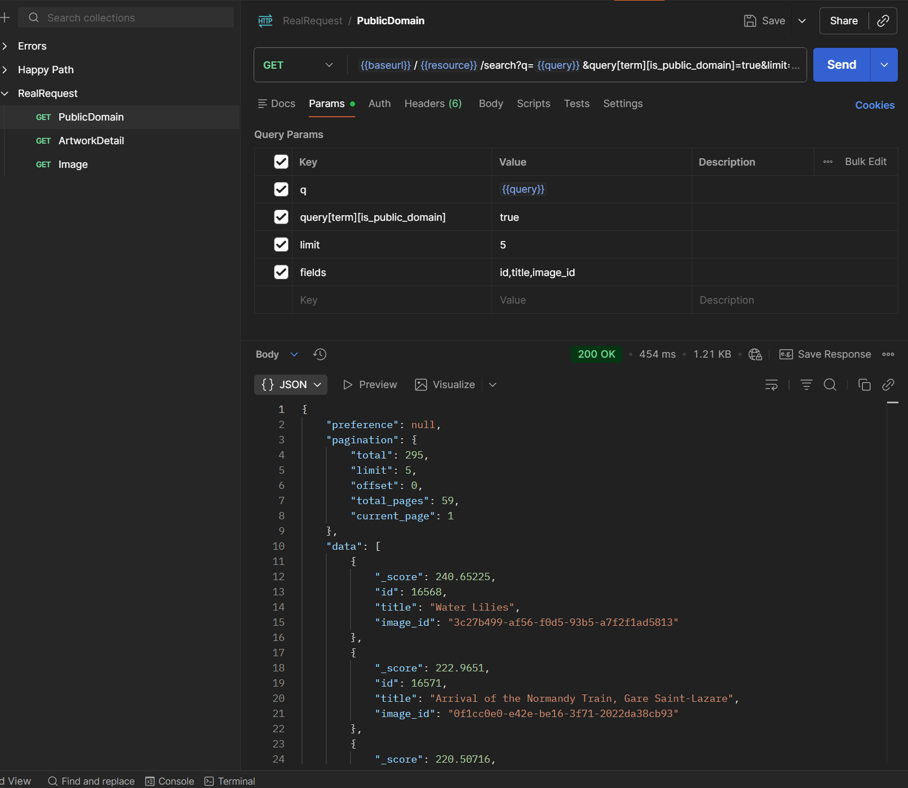
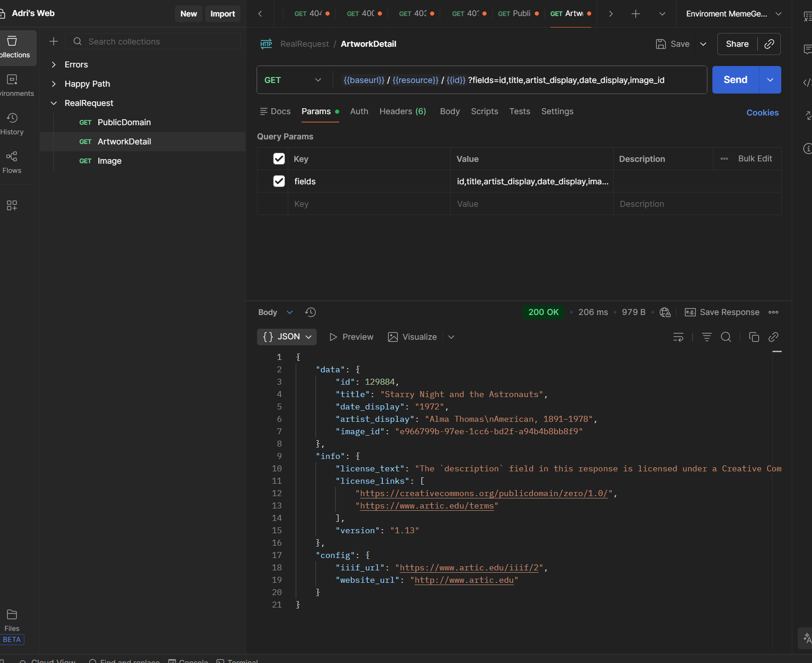
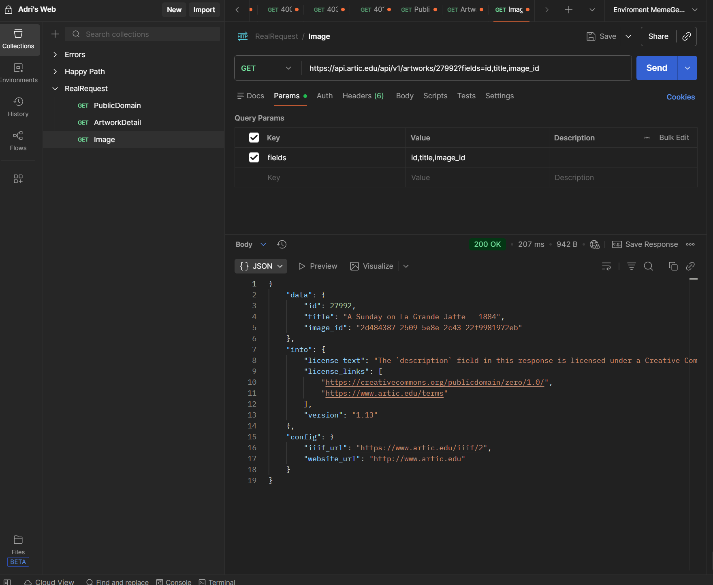
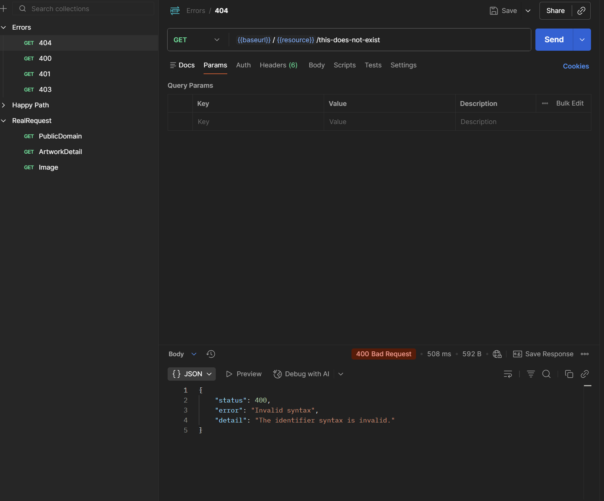
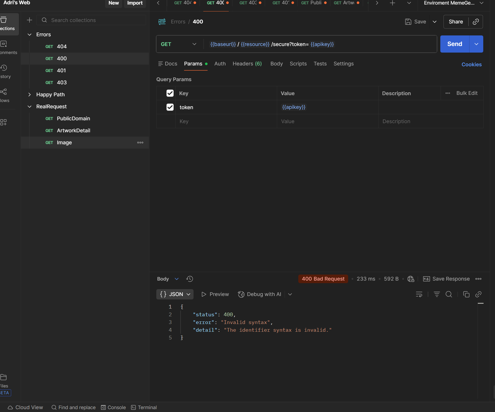
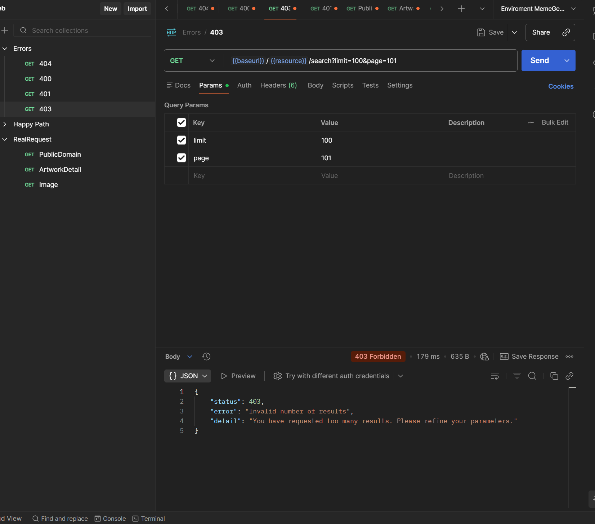

# API Onboarding Report — Art Institute of Chicago

---

## API 

| Field | Detail |
|-------|--------|
| **Name** | Art Institute of Chicago API |
| **Base URL** | `https://api.artic.edu/api/v1` |
| **Auth Type** | No authentication required (public) |
| **Rate Limit** | Not specified |

---

## Endpoints Table

| Method | URL | Query Params | Headers | Expected Status | Obtained Status |
|--------|-----|--------------|---------|-----------------|-----------------|
| GET | `{{baseurl}}/{{resource}}/search` | `q={{query}}`, `query[term][is_public_domain]=true`, `limit=5`, `fields=id,title,image_id` | `AIC-User-Agent: test` | 200 OK | 200 OK |
| GET | `{{baseurl}}/{{resource}}/{{id}}` | `fields=id,title,artist_display,date_display,image_id` | `AIC-User-Agent: test` | 200 OK | 200 OK |
| GET | `{{baseurl}}/{{resource}}/27992` | `fields=id,title,image_id` | `AIC-User-Agent: test` | 200 OK | 200 OK |
| GET | `{{baseurl}}/{{resource}}/this-does-not-exist` | — | `AIC-User-Agent: test` | 404 Not Found | 400 Bad Request |
| GET | `{{baseurl}}/{{resource}}/secure` | `token={{apikey}}` | `AIC-User-Agent: test` | 401 Unauthorized | 400 Bad Request |
| GET | `{{baseurl}}/{{resource}}/search` | `limit=100`, `page=101` | `AIC-User-Agent: test` | 403 Forbidden | 403 Forbidden |

---

## Response Evidence

### Successful

#### 1) PublicDomain — GET /artworks/search — 200 OK

#### 2) ArtworkDetail — GET /artworks/129884 — 200 OK

#### 3) Image — GET /artworks/27992 — 200 OK

---

### Failed

#### 4) Error 404 (returns 400 Bad Request — Invalid syntax)

#### 5) Error 400 (Bad Request — invalid token in path)

#### 6) Error 403 (Forbidden — too many results requested)

---

> **Environment variables used :**
> - `{{baseurl}}` = `https://api.artic.edu/api/v1`
> - `{{resource}}` = `artworks`
> - `{{id}}` = `129884`
> - `{{query}}` = `monet`
> - `{{apikey}}` = `N/A`
