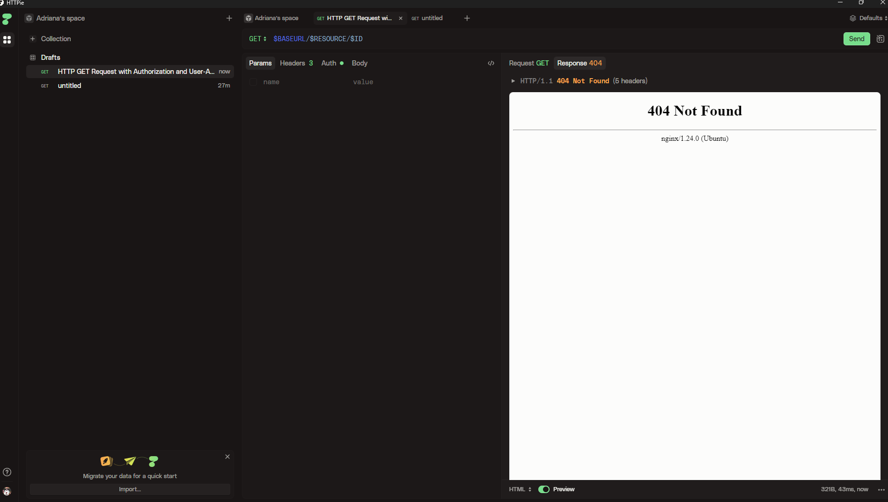

# httpie-commands

## Variables 
```bash
export BASEURL="https://api.artic.edu/api/v1"
export RESOURCE="artworks"
export ID="129884"
export QUERY="monet"
export TOKEN="mi_token_valido"
export TOKEN_FALSO="token_invalido_123"
```

---

# Happy Path

## 1) Run_baseUrl
```bash
http $BASEURL \
  AIC-User-Agent:"test"
```

## 2) Run_resource
```bash
http $BASEURL/$RESOURCE \
  AIC-User-Agent:"test"
```

## 3) Run_id
```bash
http $BASEURL/$RESOURCE/$ID \
  AIC-User-Agent:"test"
```

## 4) Run_query
```bash
http $BASEURL/$RESOURCE/search \
  q=="$QUERY" \
  AIC-User-Agent:"test"
```

## 5) Run_apikey
No hay apikey real en esta API, se demuestra el intento
```bash
http $BASEURL/$RESOURCE \
  AIC-User-Agent:"test" \
  X-API-Key:"no-key"
```

---

# RealRequest

## 6) PublicDomain
```bash
http $BASEURL/$RESOURCE/search \
  q=="$QUERY" \
  'query[term][is_public_domain]==true' \
  limit==5 \
  fields=="id,title,image_id" \
  AIC-User-Agent:"test"
```

## 7) ArtworkDetail
```bash
http $BASEURL/$RESOURCE/$ID \
  fields=="id,title,artist_display,date_display,image_id" \
  AIC-User-Agent:"test"
```

## 8) Image (reemplazá IMAGE_ID por el image_id que devuelve ArtworkDetail)
```bash
http https://www.artic.edu/iiif/2/IMAGE_ID/full/843,/0/default.jpg \
  AIC-User-Agent:"test"
```

---

# Auth

## 9) Auth correcta
```bash
http $BASEURL/$RESOURCE/$ID \
  Authorization:"Bearer $TOKEN" \
  AIC-User-Agent:"test"


```

## 10) Auth fallida
```bash
http $BASEURL/$RESOURCE/$ID \
  Authorization:"Bearer $TOKEN_FALSO" \
  AIC-User-Agent:"test"


```

---

# Errors

## 11) 404 Not Found
```bash
http $BASEURL/$RESOURCE/this-does-not-exist \
  AIC-User-Agent:"test"
```

## 12) 400 Bad Request
```bash
http $BASEURL/$RESOURCE \
  page==abc \
  limit==12 \
  AIC-User-Agent:"test"
```

## 13) 403 Forbidden
```bash
http $BASEURL/admin \
  Authorization:"Bearer $TOKEN_FALSO" \
  AIC-User-Agent:"test"
```

